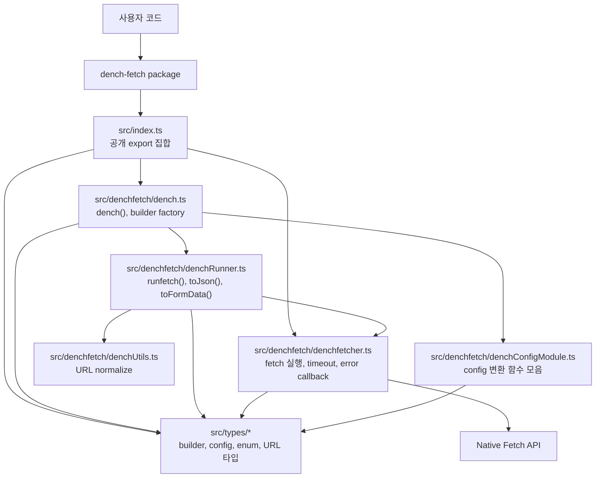
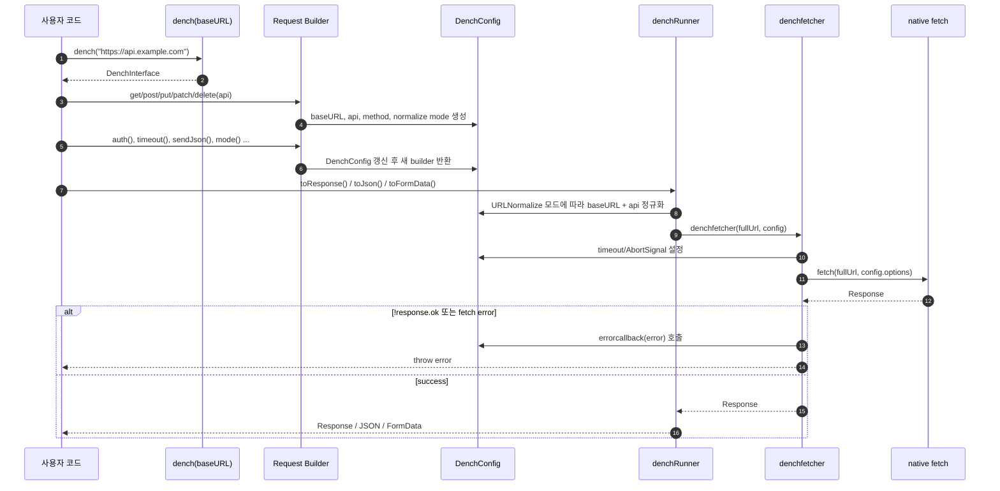
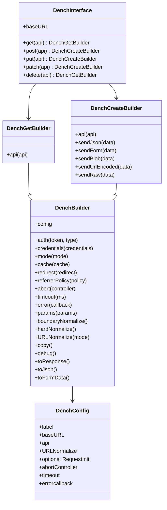

# dench-fetch Architecture

이 문서는 현재 `src` 기준의 `dench-fetch` 라이브러리 구조를 요약합니다.

## 1. 모듈 구조

## 2. 요청 실행 흐름

## 3. Builder와 Config 관계

## 4. 책임 분리

| 영역 | 파일 | 역할 |
| --- | --- | --- |
| Public API | `src/index.ts` | `dench`, `denchfetcher`, enum, type export |
| Builder factory | `src/denchfetch/dench.ts` | HTTP method별 builder 생성, 체이닝 API 구성 |
| Config mutation | `src/denchfetch/denchConfigModule.ts` | auth, timeout, body, fetch option 설정 |
| Runner | `src/denchfetch/denchRunner.ts` | URL 정규화 후 fetcher 호출, 응답 변환 |
| Fetch adapter | `src/denchfetch/denchfetcher.ts` | native `fetch` 호출, timeout/abort/error 처리 |
| URL utility | `src/denchfetch/denchUtils.ts` | `boundaryNormalize`, `hardNormalize` |
| Type system | `src/types/*` | Builder, config, enum, URL literal type 정의 |

## 5. 현재 코드 기준 메모

- `dench(baseURL, label?)`은 `DenchInterface`를 반환하고, `label`이 있으면 `DenchInstancePreset`에도 인스턴스를 저장합니다.
- `GET`, `DELETE`는 `DenchGetBuilder`, `POST`, `PUT`, `PATCH`는 body 전송 메서드가 있는 `DenchCreateBuilder`를 사용합니다.
- 체이닝 메서드는 대체로 새 `DenchConfig`를 만들어 새 builder를 반환합니다. 단, `errorConfig()`는 현재 config 객체에 `errorcallback`을 직접 설정합니다.
- `toResponse()`, `toJson()`, `toFormData()`가 실제 실행 지점입니다. 그 전까지는 builder/config 구성 단계입니다.
- 기본 URL 정규화 모드는 `DenchURLNormalizeMode.BOUNDARY`입니다.
- `paramsConfig()`는 입력을 `URLSearchParams`로 변환하는 분기는 있지만, 현재 반환 config나 최종 요청 URL에는 query string을 반영하지 않습니다.
- `denchfetcher()`는 `response.ok`가 false이면 Error를 던지고, 등록된 `errorcallback`이 있으면 다시 throw 하기 전에 호출합니다.

